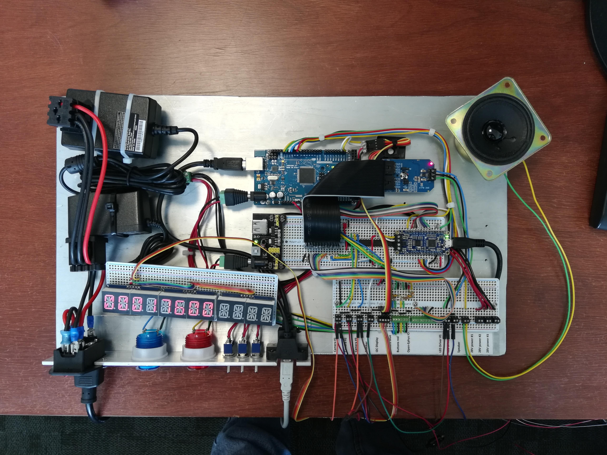

# PCbox-for-rodent-behavior
  A simple pradigm control box (board) for rodent behavior.  
 
  
  **Features**
  - Jupyter notebook interface to control Arduino inside of the box.
  - Synchronize up to 3 cameras (signal level: 3.3V).
  - Auditory stimulus by a built-in soundboard using wav files.
  - TTL trigger for one shocker (Med Associate XXXX).
  - Three 28V power supplies for fans and lamps.
  - Generate sinusoidal analog signal to control two external LED drivers.
  
  **Potential set up**

  
