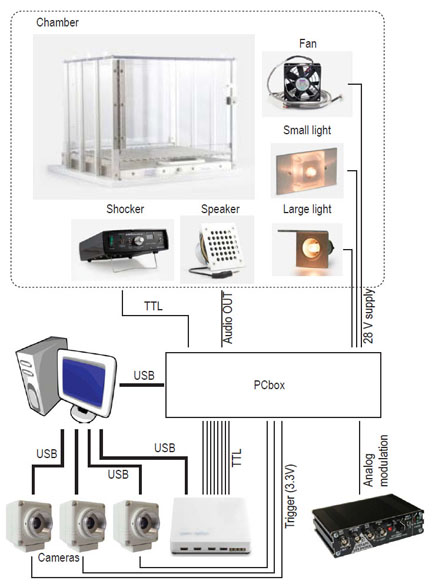

# PCbox-for-rodent-behavior
  A simple pradigm control box (board) for rodent behavior.  
 
  
  **Features**
  - Jupyter notebook interface to control Arduino inside of the box.
  - Synchronize up to 3 cameras (signal level: 3.3V).
  - Auditory stimulus by a built-in soundboard using wav files.
  - TTL trigger for one shocker (Med Associate XXXX).
  - Three 28V power supplies for fans and lamps.
  - Digital IOs to trigger your recording system.
  - Generate sinusoidal analog signal to control two external LED drivers.
  
  **Potential set up**
  Speaker https://www.med-associates.com/product/cage-speaker-for-rat-chamber/
  Fan https://www.med-associates.com/product/28-v-dc%e2%80%88fan/
  Chamber https://www.med-associates.com/product/modular-test-chamber-with-quick-change-floor-for-rat/
  Small light https://www.med-associates.com/product/housestimulus-light-with-diffuser-for-rat/
  Large light https://www.med-associates.com/product/cubicle-ceiling-mount-house-light/
  Shocker https://www.med-associates.com/product/standalone-aversive-stimulatorscrambler-115-v-ac-60-hz/
  
